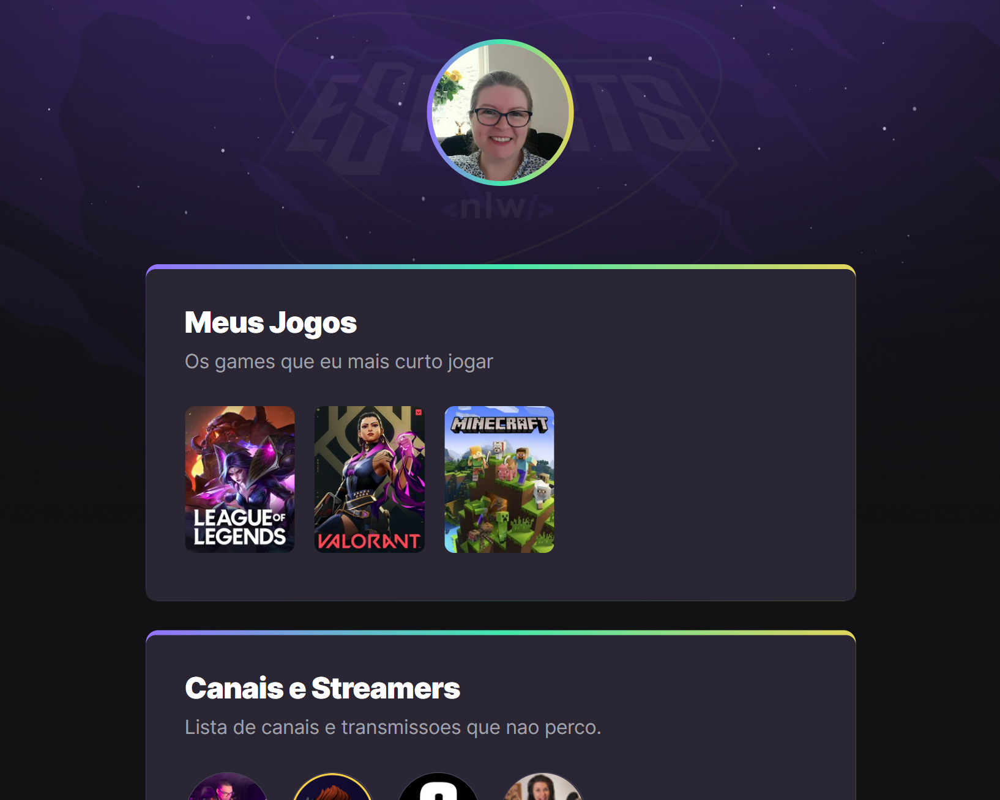

# NLW - eSports

> trail explorer.

Project built during the Next Level Week - eSports.

Event held by Rocketseat, to accelerate the learning process in programming, regardless of the level of knowledge. Where was developed a brilliant project of the universe of games, to learn new skills and technologies and accelerate the career as dev.

September 11 to 18, September 2022 

[Click here to acsess:](https://adriana-camarotto.github.io/NLW-sports-explorer/)

---

## 🚀Tecnologies

- HTML
- CSS
- Git E Github

---

## 📚What have I learned.
 
This was my first front end project. I started from the complete zero Knowledge in coding to this amazing Project! I am very excited to the next level!

---

## 📧 Contact

adriana.camarotto@gmail.com
